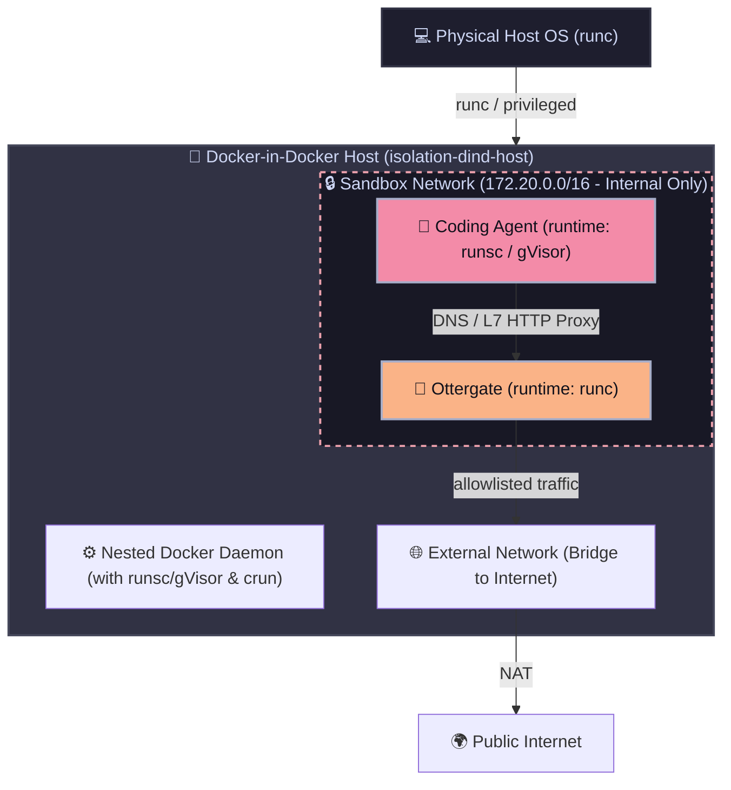

# Isolation SecMesh: Nested DinD & gVisor Sandbox

Welcome to **Isolation**, a cutting-edge container virtualization and security sandboxing environment. 

This project solves a critical security challenge: running untrusted developer/coding agents safely. By using a **Docker-in-Docker (DinD)** host combined with the **gVisor (`runsc`)** kernel virtualization runtime and the **Ottergate** Zero-Trust L7 DNS/Proxy, agents are double-sandboxed and isolated from your host system and private network.

---

## 🛡️ Architecture & Security Model

The security boundaries are constructed across multiple nested virtualization layers:



### 1. Hardened Nested Virtualization (gVisor)
The physical host runs a Docker-in-Docker container (`isolation-dind-host`) in privileged mode. Inside this container, a nested Docker daemon is initialized. The nested daemon is configured to run the **gVisor (`runsc`)** container runtime. 
All coding agents execute inside this nested daemon using **gVisor**, which intercept and virtualize kernel system calls, shielding the DinD kernel (and ultimately your host system kernel) from container escapes or exploit attempts.

### 2. Zero-Trust Network Control (Ottergate)
The agents run on an **internal-only** bridge network (`172.20.0.0/16`) with no direct internet access (`internal: true`).
Instead, all agent DNS queries and outbound L7 (HTTP/HTTPS) traffic are intercepted by the **Ottergate L7 Sandbox Router/Proxy** (`172.20.0.53`). Ottergate transparently parses HTTP Host headers and TLS SNIs, allowing connections only to explicitly allowlisted domains (e.g., GitHub, GitLab, NPM registries, and authorized LLM APIs) while strictly blocking access to local/private networks (SSRF prevention).

---

## 📁 Directory Structure

```bash
isolation/
├── docker/
│   ├── Dockerfile.dind            # Outer DinD Host setup
│   ├── Dockerfile.base            # Agent base image with dynamic CLI vaults/guards
│   ├── Dockerfile.agent           # Specific agent build file
│   ├── daemon.json                # Nested docker daemon (gVisor configuration)
│   ├── entrypoint-dind.sh         # DinD bootstrapper (clones Ottergate, starts nested compose)
│   └── docker-compose.inner.yml   # Nested Docker orchestration (Ottergate & Agent)
├── config/
│   └── config.json                # Ottergate DNS & Firewall policy configuration
├── src/                           # Custom agent compilation tools and path locks
│   ├── app-firewall.js            # Node FS path hook & security policy
│   ├── cli-vault.c / net-proxy.c  # GCC libraries preventing token leak & proxying bypass
│   └── *.sh                       # Shell wraps for git/gh binaries
├── agents/                        # Blueprints for agents (gemini, codex, pi, etc.)
├── instances/                     # Dynamic running workspace directories (synchronized)
├── Makefile                       # Execution and control interface
└── docker-compose.yml             # Host-level orchestration (DinD start/stop)
```

---

## 🚀 Quick Start & Operations

### 1. Build and Boot the Sandboxing Infrastructure
To launch the outer Docker-in-Docker container, start the nested Docker daemon, clone Ottergate, and spin up the L7 proxy:
```bash
docker compose up -d
```

Verify that the DinD container is running and initialize the nested environments:
```bash
docker ps
# isolation-dind-host should be active
```

Wait until the nested daemon is fully initialized and the nested Ottergate service reports `healthy` (approx. 20-30 seconds on first run, as it builds the base agent image inside the nested daemon).

### 2. Running an Agent
Since `make` might not be installed on your host system, you can run or shell into agents directly using `docker exec` against the DinD host:

#### Run an Agent (Headless Mode)
To run a specific agent blueprint (e.g. `pi`, `gemini`, `codex`) in headless mode:
```bash
# Set environment variables for the run session
export AGENT_TYPE=pi
export INSTANCE_NAME=pi_session_1
export HOST_UID=$(id -u)
export HOST_GID=$(id -g)

# Provision the instance secrets locally first
./Makefile setup-instance  # (or run the shell scripts/Makefile commands)

# Run inside nested gVisor
docker exec -it \
    -e AGENT_TYPE \
    -e INSTANCE_NAME \
    -e HOST_UID \
    -e HOST_GID \
    isolation-dind-host \
    docker compose -p isolation -f /app/docker/docker-compose.inner.yml run --rm agent
```

#### Run an Interactive Shell Inside the Agent
To debug or explore inside the agent sandbox securely:
```bash
export AGENT_TYPE=pi
export INSTANCE_NAME=pi_debug_1

docker exec -it \
    -e AGENT_TYPE \
    -e INSTANCE_NAME \
    isolation-dind-host \
    docker compose -p isolation -f /app/docker/docker-compose.inner.yml run --entrypoint /bin/sh --rm agent
```

---

## 🧼 Teardown and Cleanup

To safely stop and remove the outer DinD container along with all nested images and volumes:
```bash
# Nuclear teardown
docker compose down -v
```
This wipes all nested docker caches, cgroups, network bridges, and Ottergate runtime states clean, leaving your physical host completely unaffected.
