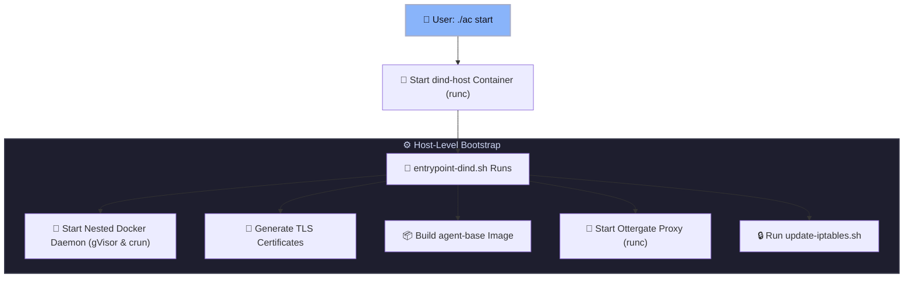
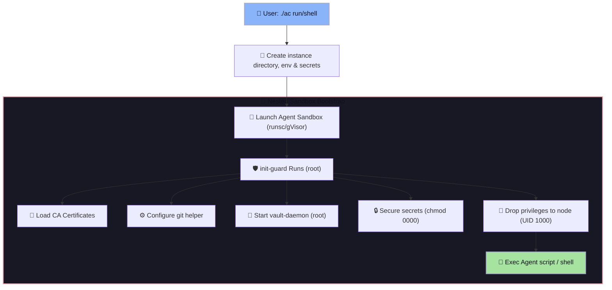
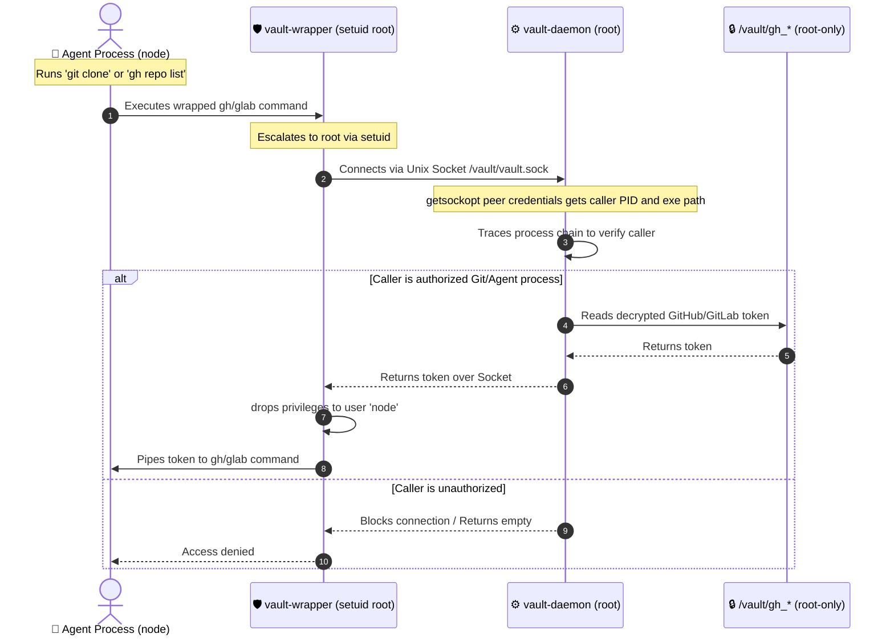
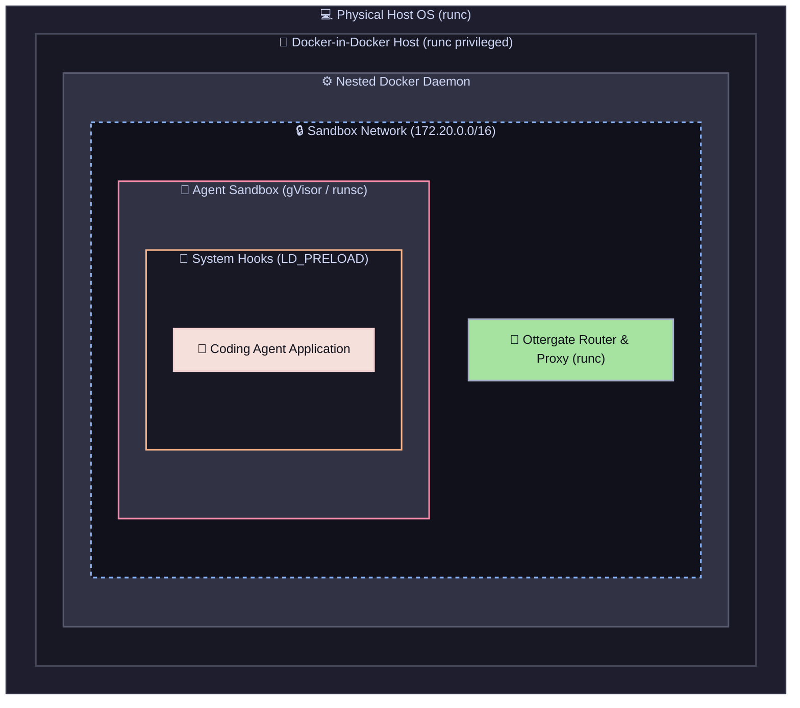

# agents container

this project provides a hardened container virtualization and security sandboxing environment to run untrusted developer or coding agents safely. it utilizes docker-in-docker, gvisor kernel virtualization, and the zero-trust l7 proxy.

the zero-trust l7 proxy is powered by [ottergate](https://github.com/gni/ottergate), which inspects outbound DNS and HTTPS traffic to enforce domain-level access control.

## operational commands

setup and boot infrastructure: build base images, start the nested docker daemon, and spin up the zero trust proxy.
```bash
./ac start
```

list active sandboxes and workspaces: check running containers, status details, and provisioned workspaces.
```bash
./ac list
```

check status and resource metrics: inspect container health, cpu/memory utilization, and disk space usage.
```bash
./ac status
```

run agent sandbox in headless mode: execute an agent blueprint in non-interactive background mode.
```bash
./ac run pi my_pi_run
```

run interactive shell inside sandbox: spawn a secure shell inside the agent container for interactive debugging.
```bash
./ac shell pi my_pi_debug
```

limit agent sandbox resources: restrict cpu, memory allocation, or gpu devices on sandbox start.
```bash
./ac run pi my_pi_run --cpus 2 --memory 1g
```

view host logs: stream operational logs of the outer docker-in-docker host container.
```bash
./ac logs host
```

view zero trust proxy logs: inspect domain routing, dns resolution, and network allowlist decisions.
```bash
./ac logs proxy
```

view gvisor kernel logs: trace user-space kernel events, system calls, and platform logs.
```bash
./ac logs gvisor
```

view specific agent logs: retrieve the terminal output of an active or stopped sandbox container.
```bash
./ac logs agent my_pi_run
```

clean sandbox credentials: wipe transient git/github/gitlab credentials while preserving local workspace files.
```bash
./ac clean my_pi_run
```

destroy sandbox workspace: stop the sandbox container and delete both its credentials and workspace files.
```bash
./ac destroy my_pi_run
```

teardown nested environments: stop the outer host daemon, remove all nested containers, and clear cache storage.
```bash
./ac down
```

## architecture and security model

the security boundaries are constructed across nested virtualization, system call virtualization, privilege control, and network policies:


## host bootstrap pipeline

the host bootstrap process starts the outer dind container, generates certificates, sets up the nested docker network, and launches default network proxy utilities:



## sandbox instance startup pipeline

when running a specific sandbox instance, the agent provisioning scripts configure local vault spaces before dropping privileges to start execution:



## credential vault security model

tokens are mounted to a secure directory, copied to root-only storage, cleared from memory, and accessed through process verification checks:



## network traffic redirection and proxying

the agent network is internal-only, redirecting all outbound connections through custom system hooks to the zero-trust filtering firewall:

```mermaid
graph LR
    subgraph Step1 ["1. DNS Resolution"]
        Agent["🤖 Agent"] -->|Queries domain| DNS["🌐 Ottergate DNS"]
        DNS -->|Check allowlist| DNSResult{"Allowed?"}
    end

    subgraph Step2 ["2. Interception"]
        DNSResult -->|Yes| Connect["🔌 syscall: connect"]
        DNSResult -->|No| NXDOMAIN["🚫 Block connection"]
        Connect -->|net_proxy.so intercepts| Redirect["🔀 Redirect to 172.20.0.53"]
    end

    subgraph Step3 ["3. L7 Filtering"]
        Redirect -->|Hits Ottergate Proxy| Proxy["🔒 Ottergate Proxy"]
        Proxy -->|Inspect SNI/Host| L7Result{"Allowlisted?"}
    end

    subgraph Step4 ["4. Egress"]
        L7Result -->|Yes| Internet["🌍 Public Internet"]
        L7Result -->|No| Drop["🚫 Drop connection"]
    end

    style Step1 fill:#181825,stroke:#313244,stroke-width:1px,color:#cdd6f4
    style Step2 fill:#181825,stroke:#313244,stroke-width:1px,color:#cdd6f4
    style Step3 fill:#181825,stroke:#313244,stroke-width:1px,color:#cdd6f4
    style Step4 fill:#181825,stroke:#313244,stroke-width:1px,color:#cdd6f4
    style Agent fill:#f38ba8,stroke:#a6adc8,stroke-width:2px,color:#11111b
    style DNS fill:#89b4fa,stroke:#a6adc8,stroke-width:2px,color:#11111b
    style Internet fill:#a6e3a1,stroke:#a6adc8,stroke-width:2px,color:#11111b
```



## system virtualization stack

the runtime environment uses a nested container layout to segregate privileges, restrict system calls, and inspect outbound requests:




## author

author: Lucian BLETAN

## license

licensed under the Apache License, Version 2.0.
